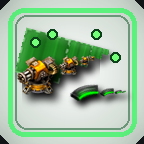

# Turret Ammo Planner

A GUI-configurable planner for turret ammunition.

Choose an ammo item, count, quality, and mode, then drag over turrets to create bot item requests.

## Modes

- Set exactly: removes existing turret ammo and requests the configured ammo/count.
- Top up: requests enough configured ammo to reach the configured count.
- Clear: requests removal of turret ammo.

## Usage

1. Press Ctrl+Shift+T or click the shortcut.
2. Pick ammo, count, quality, and mode.
3. Click "Put planner in cursor".
4. Drag over turrets.

## License

> [MIT](https://opensource.org/licenses/MIT)
